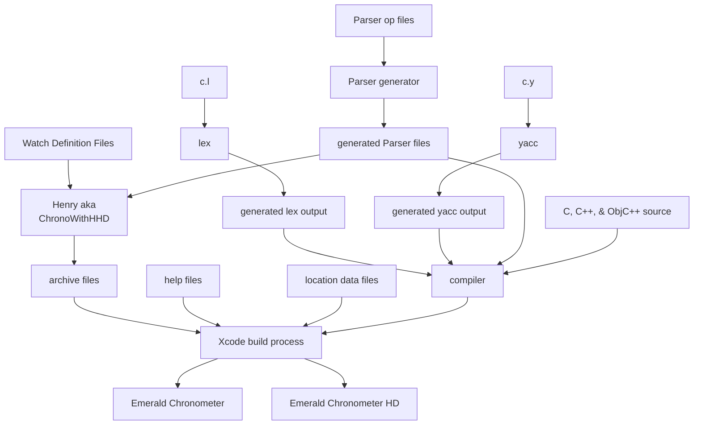

## Overview

This directory currently contains code only for the iOS version of
Emerald Chronometer.  Code for the WearOS version of Chronometer is not included
in directory and is not currently on GitHub.
The build process for the iOS version of Emerald Chronometer is
divided into two main pieces:

1.  A preprocessor iOS Simulator app nicknamed
    [Henry](https://github.com/EmeraldSequoia/docs/blob/main/Glossary.md#henry) and
    found in the Xcode product
    [ChronoWithHHD](https://github.com/EmeraldSequoia/docs/blob/main/Glossary.md#chronowithhhd)
    is run to generate assets. This step is only necessary when a watch definition has
    changed, either functionally or in appearance; the outputs of the preprocessor are
    checked into the repository under the
    [archiveHD](https://github.com/EmeraldSequoia/Chronometer/tree/main/archiveHD)
    directory. Instructions for running this step are
    [here](https://github.com/EmeraldSequoia/Chronometer/blob/main/specs/henry.md).
2.  The Xcode build process for Chronometer uses runtime code, the assets generated by
    the simulator, and other assets generated on the fly, to construct the apps. There
    are two Xcode `products` (Chronometer and ChronometerHD), but the differences between
    them are very small (mostly app metadata indicating what devices are supported,
    "grid mode" layout, and the handling of device orientations).




## Building

You will need some additional libraries that may be found in parallel repositories to this
one, and they must be also placed parallel to this one on your local disk. One way to do
this would be:

```
mkdir emeraldsequoia
cd emeraldsequoia
git clone git@github.com:EmeraldSequoia/Chronometer.git
git clone git@github.com:EmeraldSequoia/buildscripts.git
git clone git@github.com:EmeraldSequoia/esutil.git
git clone git@github.com:EmeraldSequoia/estime.git
git clone git@github.com:EmeraldSequoia/eslocation.git
git clone git@github.com:EmeraldSequoia/esastro.git
```

## Selected details

### Watch definition files (XML)

Watches are defined in XML files inside the
[watches/Builtin](https://github.com/EmeraldSequoia/Chronometer/tree/main/Watches/Builtin)
subdirectory. Each watch gets its own directory, which always contains a single XML file
containing the watch definition, and usually also contains other assets used in the
definition, such as images for hands and backgrounds.

The parser of these files is
[ECWatchDefinitionManager](https://github.com/EmeraldSequoia/Chronometer/blob/main/Classes/ECWatchDefinitionManager.m).
Since at present there is no documentation for the XML syntax used, these files are best
understood by examining the parser code linked above and comparing the XML files with the
watch display it is defining. Another way of tracking down how the parameters are used is
to go to the `QView` class that
[Henry](https://github.com/EmeraldSequoia/docs/blob/main/Glossary.md#henry)
uses to draw the part.  For example, the `radius2` attribute of the `QDial` XML element (parsed
[here](https://github.com/EmeraldSequoia/Chronometer/blob/main/Classes/ECWatchDefinitionManager.m#L737))
is used in the `QDialView` class
[here](https://github.com/EmeraldSequoia/Chronometer/blob/main/Classes/ECQView.m#L2435).

### Expressions, the "Parser", and VMs

Many of the attributes defined in the XML files are C-like expressions. These are parsed
into byte code by the
[Parser](https://github.com/EmeraldSequoia/docs/blob/main/Glossary.md#parser), and
interpreted by a
[VM](https://github.com/EmeraldSequoia/docs/blob/main/Glossary.md#virtual-machine-vm)
inside each runtime "watch".

### Help files

One of the original goals for EC was to be able to run without access to a network, for
use in remote areas (all of the astronomy calculations are done on the device, for
example). Similarly, the help files are also all bundled with the application and don't
require a network to view (though most of them are mirrored in a slightly different way
on the website). At build time, a script is invoked (in an Xcode "build phase") to copy
the files out of
[the source area](https://github.com/EmeraldSequoia/Chronometer/tree/main/Help) into
the app bundle.

### OpenGL

All of Emerald Chromnometer's watch displays are drawn with OpenGL. This protocol is
currently deprecated on iOS, but so far is fully supported by the OS runtime.

EC uses only a small portion of the OpenGL API. In particular, it only
uses 2D primitves, and it only draws triangles with textures. While
OpenGL is fundamental to the current implementation of EC, it should
be possible to subsitute another high-performance graphics package
with similar primitives, probably without even changing the format of
the
[archives](https://github.com/EmeraldSequoia/docs/blob/main/Glossary.md#archive)
created by Henry.

In simplified terms, what EC does is

1. Tell OpenGL the current coordinate mapping.
2. Attach an
   [atlas](https://github.com/EmeraldSequoia/docs/blob/main/Glossary.md#atlas) with the
   images of each part in it.
3. Give OpenGL a pair of triangle lists: One list has the dimensions of the part triangles in
   the atlas image, and the other list has the corresponding coordinates on the screen to draw
   each triangle. This has the effect of drawing a given part with a given texture background
   at the given coordinates (parts are rectangular in shape, but a rectangle is trivially
   decomposed into two triangles with a diagonal line).

### Memory management

At runtime, great care is taken to manage memory on the device. This is far less important
now than it used to be (see [History](#history) below), but for the original device it was
critical to being able to have more than a few watches enabled. Even today, it is required
to be able to respond to OS requests to reduce memory, particularly when running in the
background, lest the app be forcibly removed.

In particular:
*   Management of the texture atlases and of the other watch data is done in a background
    thread to keep ready for drawing the watches most likely to be viewed next. This includes
    dropping atlases when a memory warning is received.
*   OpenGL is used to minimize the amount of code and data required to be in memory in
    order to draw.

## The Mechanical Model

EC watches are intentionally models of mechanical devices. For an internal manifesto, see
[here](https://github.com/EmeraldSequoia/Chronometer/blob/main/MM-manifesto.md). For a less
polemic view intended for the public :), see
[here](https://emeraldsequoia.github.io/h/mmm.html).

## Adding a new watch

Adding a new watch is normally as "simple" as creating a new directory in `Watches/Builtin`,
adding a new XML file (see above), adding any assets required to the directory, and adding the
watch to
[the list of "approved" watches](https://github.com/EmeraldSequoia/Chronometer/blob/main/Watches/Builtin/Approvals.txt).
However, the current count of 25 watches means that additional work will be needed in order
to support a 26th watch, since the current grid of 5x5 watches in "grid mode" is the
maximum size currently supported. To go beyond this, various hand-coded layout arrays
would need to be expanded starting around
[here](https://github.com/EmeraldSequoia/Chronometer/blob/main/Classes/ChronometerAppDelegate.m#L333).
Alternatively, one of the nine "bonus parting gift" watches could be removed, as they are of lesser
value anyway.

## Testing

There are almost no explicit tests in the entire EC project. Extensive manual testing was
done for every new subsystem as it was brought online, and the products have had very few
bugs in their 15-year lifetime (on the order of a dozen customer-visible bugs in that time).
This is, in part, because much of the most complex code was written and maintained by a
single person; the lack of tests is much more problematic in today's GitHub environment.

That said, the code is extremely stable, and since the pieces are very low-level and don't,
as a rule, have external dependencies, it's unlikely that the low-level code will break.
The use of XML as the way watches are defined means that no new code needs to be written
to change a watch definition.

## History

The complexity evident in the diagram at the top of this page stems from two early goals
of the project:
1.  Be able to swipe through many watches without running out of memory on the device (the
    original iPhone only had about 128 megabytes available to applications, including
    backing storage for Quartz view elements). Much of the
    [Memory management](#memory-management) done in the app is not required today, but it
    would be very difficult to change now.
2.  Be able to define new watches just using XML so that we don't have to write any
    Objective-C++ code to define a new watch (this simplifies code paths and makes it easier
    to test the code that does exist). We also originally intended that users be able to
    define their own watches, but we dropped this goal early on (for one thing, allowing
    customers to define their own watches would open up security holes in the bytecode
    interpreter; for another, better error handling and documentation would need to be
    provided).
    
